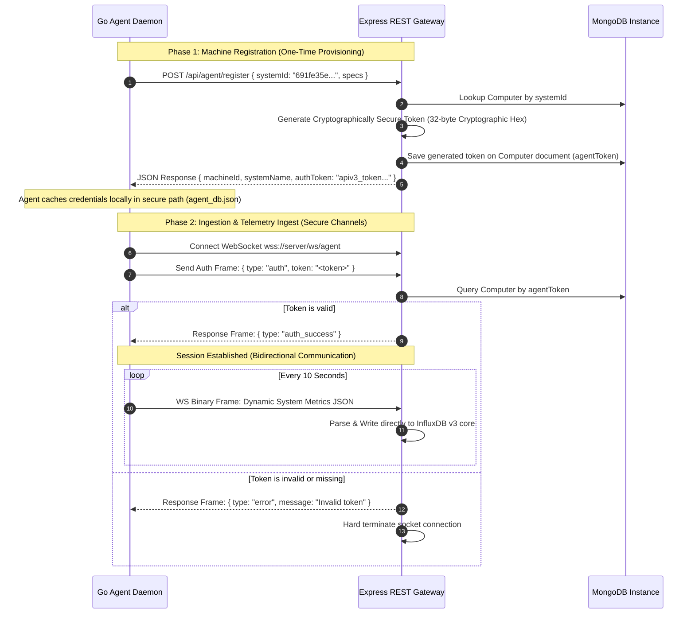

# Negces Lab — Security Architecture & Agent Authentication Protocols

This document details the security model, cryptographic protocols, token exchange mechanisms, and data integrity verification used to secure communication between the **Negces Lab Express Server** and the distributed Go Agent daemons (`negceslab-agent`).

---

## 1. Threat Model & Security Objectives

The telemetry system collects hardware states and attendance logs from physical lab computers. The security design guarantees:
- **Write Authorization:** Only registered hardware agents can write metrics to InfluxDB and submit attendance logs.
- **Masquerade Protection:** Malicious clients cannot spoof metrics or logs on behalf of other laboratory computers.
- **Transport Security:** All traffic is encrypted in transit using Transport Layer Security (TLS) and Secure WebSockets (WSS).

---

## 2. Interactive Protocol Flow & Cryptographic Token Exchange

The agent authentication flow consists of two phases: **Machine Registration** (Provisioning) and **Authorized Telemetry Transmission** (Streaming & Ingestion).



---

## 3. Endpoint Security Audits

All agent-facing Express endpoints are classified below by their access level and security controls:

### A. Write Ingestion Endpoints (Strictly Authorized)

#### 1. WebSocket Telemetry Ingest (`/ws/agent`)
- **Protocol:** RFC 6455 Secure WebSocket upgrade connection.
- **Verification:** Upgraded sockets are immediately kept in an unauthenticated jail state. If an authenticated `auth` message containing a valid `agentToken` is not received within the heartbeat timeout, the socket is hard terminated.

#### 2. Offline Metrics Fallback Sync (`POST /api/agent/metrics`)
- **Headers Required:** `Authorization: Bearer <agentToken>`
- **Middleware:** `verifyAgentToken` interceptor queries MongoDB. If the matching system token is not found, the request is rejected with `403 Forbidden`.

#### 3. Student Attendance Logging (`POST /api/agent/attendance`)
- **Headers Required:** `Authorization: Bearer <agentToken>`
- **Middleware:** `verifyAgentToken` interceptor locks the transaction to the specific physical computer mapped to the authenticated token. This prevents remote users from marking attendance on other physical machines.

### B. Machine Provisioning Endpoint (Open / Controlled)

#### 1. Machine Registration (`POST /api/agent/register`)
- **Purpose:** Used once during provisioning (e.g. by installer script).
- **Behavior:** Associates target system specifications with a physical machine, resets the security credentials, and generates a new secure 32-byte cryptographic token.

---

## 4. Trust Model & Local Credential Storage

Once registered, the client agent maintains a local database file `agent_db.json` containing:
```json
{
  "machine_id": "692331c4b1d17ec52f47c11a",
  "auth_token": "a1b2c3d4e5f6g7h8..."
}
```

### Local Security Safeguards:
- **File System Permissions:** The installer scripts (`install.sh` / `install.ps1`) restrict read/write access to the installation directory (`/opt/negceslab-agent/` or `C:\Program Files\NegcesLab-Agent\`) strictly to **Root / SYSTEM Administrator** permissions.
- **Jailed InfluxDB Pipeline:** Agents do not interact directly with InfluxDB and have no access to the InfluxDB SQL write tokens. All metrics must pass through the Express gateway middleware, which sanitizes, validates, and writes the telemetry data points.
