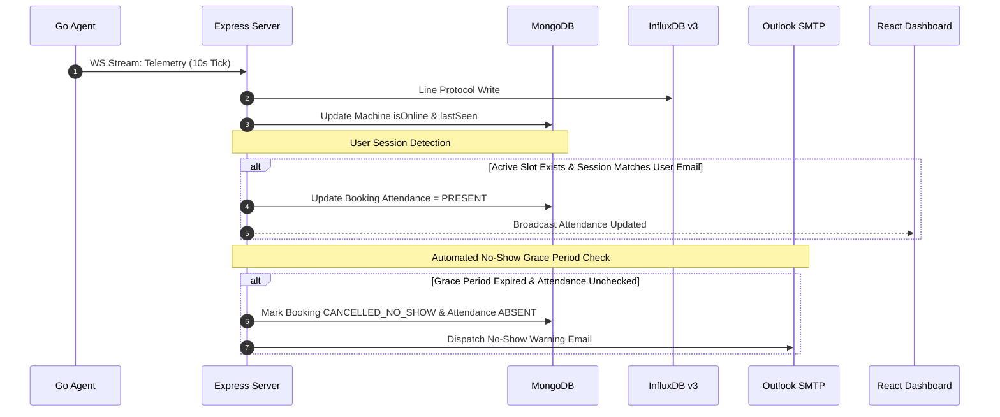
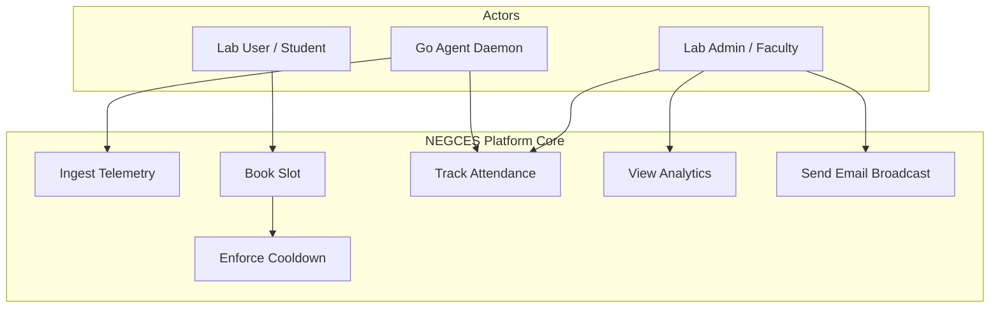

# Software Requirements Specification (SRS)
## NEGCES Lab Telemetry, Analytics & Lab Management Platform

**Document Version:** 2.0  
**Date:** September 16, 2026  
**Standards Model:** IEEE Std 29148-2018  
**Developers & Authors:**  
* **Shudarsan Regmi** (Lead Architect & Core Backend Engineer)  
* **Thuriaandh V** (Lead Systems & Frontend Dashboard Engineer)  

---

## Table of Contents
1. [Introduction](#1-introduction)
2. [Overall Description](#2-overall-description)
3. [Functional Requirements](#3-functional-requirements)
4. [Non-Functional Requirements](#4-non-functional-requirements)
5. [External Interface Requirements](#5-external-interface-requirements)
6. [Data Requirements & Schemas](#6-data-requirements--schemas)
7. [Use Cases](#7-use-cases)
8. [Analysis & Architecture Models](#8-analysis--architecture-models)
9. [Security Requirements](#9-security-requirements)
10. [Risk Analysis](#10-risk-analysis)
11. [Requirement Traceability Matrix (RTM)](#11-requirement-traceability-matrix-rtm)
12. [Acceptance Criteria](#12-acceptance-criteria)
13. [Appendices](#13-appendices)

---

## 1. Introduction

### 1.1 Purpose
This Software Requirements Specification (SRS) document defines the comprehensive functional, non-functional, security, database, and interface specifications for the **NEGCES Lab Telemetry, Analytics & Lab Management Platform (v2.0)**. 

In addition to core system telemetry collection, Version 2.0 incorporates **Cooldown Period Enforcement**, **Automated Attendance Tracking**, **User and System Analytics**, and **Email Broadcast & Transactional Notifications** via Outlook/Office365 SMTP.

### 1.2 Scope
The integrated system encompasses five core pillars:
1. **Telemetry & Metrics Collection Subsystem**: Go Agent service (`negceslab-agent`) running on client nodes, streaming CPU, RAM, GPU, Disk, Network, and thermal data over WebSockets/HTTP to an InfluxDB v3 time-series engine and MongoDB cache.
2. **Cooldown Period Enforcer**: Policy engine that enforces configurable delay intervals between consecutive user slot bookings to prevent resource monopolization.
3. **Attendance Tracking Engine**: Automated check-in via agent heartbeats, grace-period monitoring, auto-cancellation for no-shows, and manual admin attendance ledger overrides.
4. **Analytics & Reporting Platform**: User-level analytics (booking history, attendance ratios, penalty points) and System-level analytics (hardware utilization trends, peak lab hours, machine uptime, department usage).
5. **Notification & Email Broadcast System**: Asynchronous email delivery pipeline leveraging Outlook/Office365 SMTP for system-wide announcements, booking alerts, attendance warnings, and admin updates.

### 1.3 Definitions, Acronyms, and Abbreviations
* **SRS**: Software Requirements Specification
* **TTL**: Time-To-Live (Database auto-deletion index)
* **WS / WSS**: Secure WebSocket Protocol
* **InfluxDB LP**: InfluxDB Line Protocol
* **SMTP**: Simple Mail Transfer Protocol (Office365 / Outlook)
* **IEEE 29148**: International standard for systems and software engineering requirements
* **RTM**: Requirement Traceability Matrix
* **NVML**: NVIDIA Management Library (GPU query interface)

### 1.4 References
1. IEEE Std 29148-2018: Systems and Software Engineering — Life Cycle Processes — Requirements Engineering.
2. NEGCES Lab Technical Documentation ([docs/SECURITY_ARCHITECTURE.md](file:///home/aparichit/Projects/negceslab/docs/SECURITY_ARCHITECTURE.md), [docs/logging_architecture.md](file:///home/aparichit/Projects/negceslab/docs/logging_architecture.md)).
3. InfluxDB v3 Core Technical Specifications.
4. Outlook Office365 SMTP Integration Guide.

### 1.5 Document Overview
This document serves as the authoritative specification for developers, testers, and lab administrators. It covers overall product architecture, functional requirements (FR-01 to FR-20), non-functional constraints, database models, sequence/use-case diagrams, risk analysis, and requirement traceability.

---

## 2. Overall Description

### 2.1 Product Perspective
The platform unifies hardware telemetry, slot booking scheduling, user attendance, and administrative communication into a single cohesive ecosystem.

```
+---------------------------------------------------------------------------------+
|                        NEGCES Lab Ecosystem Architecture                        |
|                                                                                 |
|   +-----------------------+     +-----------------------+     +-------------+   |
|   |  Slot Booking Engine  |<--->|   Cooldown Enforcer   |<--->| Attendance  |   |
|   |   (Calendar/Slots)    |     |   (Policy Engine)     |     |  Tracking   |   |
|   +-----------------------+     +-----------------------+     +-------------+   |
|               ^                             ^                        ^          |
|               |                             |                        |          |
|               v                             v                        v          |
|   +-----------------------+     +-----------------------+     +-------------+   |
|   |  Telemetry Subsystem  |<--->|  Analytics Engine     |<--->| Email       |   |
|   | (Go Agent + InfluxDB) |     |  (User & System Stats)|     | Broadcast   |   |
|   +-----------------------+     +-----------------------+     +-------------+   |
|               ^                             ^                        ^          |
|               +-----------------------------+------------------------+          |
|                                             |                                   |
|                                             v                                   |
|                                [MongoDB 7.0 & InfluxDB v3]                      |
+---------------------------------------------------------------------------------+
```

### 2.2 Product Functions
* **Continuous Hardware Telemetry**: Automated 10-second polling of CPU, RAM, GPU (VRAM/Temp), Network, and Disk.
* **Cooldown Enforcement**: Dynamic calculation of post-booking waiting windows to enforce fair slot distribution.
* **Automated Attendance Tracking**: Real-time attendance verification matching logged-in system user sessions with slot booking schedules.
* **User & System Analytics**: Dashboard visualizations charting individual user attendance rates, lab peak usage, machine load, and department resource distribution.
* **Email Broadcast & Alerts**: System-wide announcements and automated transactional notifications sent via Outlook SMTP.
* **Admin Control & Governance**: Full audit logging, manual attendance overrides, cooldown waiver management, and machine status grids.

### 2.3 User Classes and Characteristics
* **Superadmins**: Complete system access, policy management, cooldown overrides, email broadcasting, full analytics, and system configurations.
* **Lab Coordinators / Faculty**: Read/write access to attendance ledgers, approval workflows, department analytics, and user reservation reviews.
* **Lab Users / Students**: Interface for booking slots, viewing personal attendance statistics, tracking cooldown status, and receiving email updates.
* **Hardware Go Agent**: Automated daemon service executing system polling and heartbeat sync.

### 2.4 Operating Environment
* **Client Agent Daemon**: Windows 10/11 (Windows Service) and Ubuntu Linux 20.04+ (`systemd` service).
* **Backend Server**: Node.js v20+ Express server hosted on Linux Intranet environment.
* **Databases**: MongoDB v7.0 (Document Store) and InfluxDB v3 Core (Time-Series Engine).
* **SMTP Provider**: Outlook / Office365 (`smtp.office365.com:587` with STARTTLS).
* **Frontend**: React 18 / Vite modern Web Application.

### 2.5 Design and Implementation Constraints
* **Bandwidth Cap**: Agent telemetry bandwidth shall not exceed **80 MB per machine per month**.
* **Cooldown Storage**: Cooldown policies must be evaluated in $< 50\text{ ms}$ upon slot creation requests.
* **Email Rate Limiting**: SMTP broadcast batches must observe rate limits (maximum 100 emails/minute) to comply with Office365 quotas.
* **Data Retention**: Raw telemetry in MongoDB expires after **7 days** (TTL index); InfluxDB retains 180 days of granular time-series data.

---

## 3. Functional Requirements

### 3.1 Telemetry Sampling & Ingestion (FR-01 to FR-03)
#### FR-01: Metric Sampling & Polling
* **Description**: The Go Agent shall poll system hardware metrics at a default 10-second interval.
* **Inputs**: Hardware utilization counters (CPU, RAM, GPU, VRAM, Disk IO, Network, Temperatures).
* **Processing**: Query OS APIs (`/proc`, `sysfs`, NVML, Windows Performance Counters).
* **Priority**: High.
* **Acceptance Criteria**: Polling cycle must complete in $< 500\text{ ms}$.

#### FR-02: Offline Local Queue
* **Description**: If the backend is unreachable, the Agent shall cache metrics in a local SQLite file (max 200 MB).
* **Priority**: High.
* **Acceptance Criteria**: Zero telemetry points lost during network outages lasting up to 7 days.

#### FR-03: HTTP Batch Reconnection Sync
* **Description**: Upon network restoration, the Agent shall compress cached records via Gzip and POST them to `/api/agent/sync`.
* **Priority**: Medium.
* **Acceptance Criteria**: Gzip compression ratio must exceed 80%.

---

### 3.2 Backend Processing & Dual Storage (FR-04 to FR-06)
#### FR-04: WebSocket Telemetry Stream
* **Description**: Backend shall stream live telemetry from connected Go Agents to the Admin Dashboard via WebSockets.
* **Priority**: High.
* **Acceptance Criteria**: Live metric update latency $< 200\text{ ms}$.

#### FR-05: InfluxDB Time-Series Persistence
* **Description**: Backend shall write 10-second telemetry points to InfluxDB v3 using an asynchronous line-protocol buffer.
* **Priority**: High.
* **Acceptance Criteria**: InfluxDB batch write latency $< 5\text{ seconds}$.

#### FR-06: MongoDB Downsampled TTL Cache
* **Description**: Backend shall write 1-minute averaged metrics to MongoDB with a 7-day TTL index.
* **Priority**: Medium.
* **Acceptance Criteria**: MongoDB documents must auto-expire after 604,800 seconds.

---

### 3.3 Cooldown Period Enforcer (FR-07 to FR-09)
#### FR-07: Post-Booking Cooldown Validation
* **Description**: The system shall enforce a mandatory cooldown period between consecutive slot bookings for a user.
* **Inputs**: User ID, requested slot start time, requested machine ID.
* **Processing**: Retrieve user's previous completed/cancelled booking end time. Verify `requestedStartTime >= lastBookingEndTime + cooldownMinutes`.
* **Outputs**: Booking Authorization Success OR HTTP 429 Cooldown Active Error with remaining cooldown countdown time.
* **Priority**: High.
* **Acceptance Criteria**: Rejects booking requests placed within the cooldown window with exact remaining minutes returned.

#### FR-08: Admin Cooldown Waiver
* **Description**: Authorized Administrators shall have the capability to issue explicit cooldown waivers to bypass cooldown checks for specific users or academic requirements.
* **Inputs**: Target User ID, Reason, Expiry Date, Admin Signature.
* **Processing**: Store record in `cooldownWaivers` collection; check waiver table during slot validation.
* **Priority**: Medium.
* **Acceptance Criteria**: Active waiver permits immediate slot creation regardless of recent booking end times.

#### FR-09: Dynamic Cooldown Policy Configuration
* **Description**: System shall allow admins to modify global or role-based cooldown durations (e.g. 15 mins, 30 mins, 60 mins).
* **Priority**: Medium.
* **Acceptance Criteria**: Policy changes take effect immediately without backend service restarts.

---

### 3.4 Automated Attendance Tracking (FR-10 to FR-12)
#### FR-10: Agent-Driven Auto Check-In
* **Description**: The system shall automatically record user attendance when the student logs into a lab computer matching their active slot reservation.
* **Inputs**: Active slot booking record, Go Agent system session payload (`currentUser`, `email`, machine IP).
* **Processing**: Match logged-in user email with active slot user. Update booking attendance status to `PRESENT` and log `checkInTime`.
* **Priority**: High.
* **Acceptance Criteria**: Auto check-in marked within 30 seconds of system login during a valid slot window.

#### FR-11: Grace Period Expiry & No-Show Auto-Cancellation
* **Description**: If a user fails to check in within a configurable grace period (e.g. 15 minutes after slot start time), the system shall mark the attendance as `ABSENT`, automatically cancel the slot, and free the computer for other users.
* **Inputs**: Scheduled slot start time, current time, check-in status.
* **Processing**: Cron worker checks unconfirmed slots at `slotStartTime + gracePeriod`. If unchecked, set status to `CANCELLED_NO_SHOW`, set attendance to `ABSENT`, increment user penalty points, and send email notification.
* **Priority**: High.
* **Acceptance Criteria**: Unclaimed slots auto-released within 60 seconds of grace period expiration.

#### FR-12: Manual Attendance Ledger & Overrides
* **Description**: Lab faculty/admins shall be able to view, filter, and manually update attendance records (`PRESENT`, `ABSENT`, `LATE`, `EXCUSED`).
* **Priority**: Medium.
* **Acceptance Criteria**: Manual edits logged with admin ID and timestamp in audit trail.

---

### 3.5 Analytics & Reporting Engine (FR-13 to FR-15)
#### FR-13: User Analytics Subsystem
* **Description**: System shall compute and display comprehensive user-level statistics.
* **Metrics Provided**: Total slots booked, attendance percentage ($\frac{\text{Present}}{\text{Total Booked}} \times 100$), cumulative lab hours, penalty count, and active cooldown status.
* **Priority**: High.
* **Acceptance Criteria**: Individual user profile dashboard loads full stats in $< 1\text{ second}$.

#### FR-14: System & Hardware Utilization Analytics
* **Description**: System shall aggregate machine-level and lab-level utilization metrics.
* **Metrics Provided**: Machine occupancy rates, peak usage hours heatmap, average CPU/RAM/GPU load per machine model, department-wise booking distribution, and hardware maintenance flags.
* **Priority**: High.
* **Acceptance Criteria**: Aggregates render interactive charts over selectable ranges (24h, 7d, 30d, custom date picker).

#### FR-15: Exportable Reports
* **Description**: System shall export attendance and utilization analytical data into downloadable CSV and PDF formats.
* **Priority**: Medium.
* **Acceptance Criteria**: Exported CSV/PDF matches requested date filters and contains all compliance columns.

---

### 3.6 Notification & Email Broadcast Engine (FR-16 to FR-18)
#### FR-16: Outlook/Office365 SMTP Transporter
* **Description**: System shall integrate with Outlook SMTP (`smtp.office365.com:587`, STARTTLS) to send secure HTML email messages.
* **Inputs**: SMTP credentials (`OUTLOOK_MAIL`, `OUTLOOK_APP_PASS`), recipient email, subject, HTML template body.
* **Priority**: High.
* **Acceptance Criteria**: Successfully verifies transport connection and delivers email with valid Message-ID.

#### FR-17: System-Wide & Targeted Email Broadcasts
* **Description**: Admins shall be capable of drafting and broadcasting email announcements to all lab users, specific batches, or department groups.
* **Inputs**: Recipient filter, Email Subject, Markdown/HTML Content.
* **Processing**: Queue emails in background job worker; send in rate-limited batches to prevent SMTP throttling.
* **Priority**: High.
* **Acceptance Criteria**: Broadcast sends to 500 users without blocking backend HTTP response threads.

#### FR-18: Automated Transactional Email Alerts
* **Description**: System shall automatically dispatch transactional emails for:
  * Slot Booking Confirmation & Approval/Rejection
  * Cooldown Period Activation
  * Attendance Warning / Grace Period Expiry Notice
  * System Maintenance Alerts
* **Priority**: High.
* **Acceptance Criteria**: Transactional email queued within 2 seconds of trigger event.

---

### 3.7 Frontend Dashboard & Visualization (FR-19 to FR-20)
#### FR-19: Live Machine Grid & Slot Calendar
* **Description**: React dashboard shall render a live interactive machine status grid and calendar booking interface.
* **Priority**: High.
* **Acceptance Criteria**: Grid updates machine state (Green = Available, Blue = Booked, Red = Offline, Amber = Cooldown/Maintenance) in real-time.

#### FR-20: Analytics Explorer & Admin Control Panel
* **Description**: Admin interface providing interactive chart controls, attendance management ledgers, cooldown policy sliders, and email broadcast composer.
* **Priority**: High.
* **Acceptance Criteria**: Clean responsive UI across desktop and mobile screens.

---

## 4. Non-Functional Requirements

### 4.1 Performance & Scalability
* **Metric Stream Latency**: Live telemetry stream latency $< 1.0\text{ second}$.
* **Concurrent Agent Scalability**: Backend ingestion handles 100+ concurrent Go agents sending 10s telemetry payloads without dropping connections.
* **Email Queue Processing**: Asynchronous worker handles 100 emails/minute without UI degradation.

### 4.2 Security & Compliance
* **Token Authorization**: WSS and REST endpoints require JWT token validation.
* **SMTP Encryption**: All outgoing email communication uses TLS / STARTTLS encryption.
* **Database Isolation**: Databases operate on internal docker network; no public exposure of ports 27017 or 8181.

### 4.3 Reliability & Availability
* **System Uptime**: Backend services maintain **99.9% uptime**.
* **Fault Tolerance**: Network failure triggers agent local SQLite queue; zero data loss up to 7 days offline.

### 4.4 Portability & Maintainability
* **Multi-Platform Agent**: Single Go codebase compiled natively for Windows (`.exe`) and Linux.
* **Modular Code Structure**: Standardized Express route controllers, Mongoose schemas, and React components.

---

## 5. External Interface Requirements

### 5.1 User Interface (UI)
* **Responsive React Admin Dashboard**: Displays real-time computer grid, booking calendar, attendance management ledger, user analytics cards, system utilization charts, and email broadcast composer.

### 5.2 Hardware Interface
* Go Agent interfaces directly with OS kernel interfaces (`/proc`, `sysfs`, Windows Performance Counters) and NVIDIA NVML driver libraries (`libnvidia-ml.so` / `nvml.dll`).

### 5.3 Software Interface
* **MongoDB Node Driver (Mongoose)**: Document persistence and aggregation.
* **InfluxDB Client SDK**: Time-series metric stream ingestion.
* **Nodemailer (Outlook Transport)**: Office365 SMTP email engine.
* **Firebase Admin Node SDK**: Auth token verification.

### 5.4 Communication Interface
* **WebSockets (`wss://`)**: Real-time bi-directional telemetry and machine status updates.
* **HTTPS REST API**: CRUD operations for bookings, attendance, analytics, and admin actions.
* **SMTP (`smtp.office365.com:587`)**: Secure TLS email transmission.

---

## 6. Data Requirements & Schemas

### 6.1 MongoDB Logical Data Schemas

#### A. Computers Collection (`computers`)
```json
{
  "_id": "ObjectId",
  "name": "String",
  "location": "String",
  "status": "String", // "AVAILABLE", "BOOKED", "MAINTENANCE", "OFFLINE"
  "ipAddress": "String",
  "isOnline": "Boolean",
  "lastSeen": "ISODate",
  "specifications": {
    "cpu": "String",
    "ram": "String",
    "gpu": "String"
  }
}
```

#### B. Bookings Collection (`bookings`)
```json
{
  "_id": "ObjectId",
  "userId": "ObjectId",
  "computerId": "ObjectId",
  "startTime": "ISODate",
  "endTime": "ISODate",
  "status": "String", // "PENDING", "APPROVED", "COMPLETED", "CANCELLED_NO_SHOW"
  "cooldownEndTime": "ISODate",
  "attendance": {
    "status": "String", // "PENDING", "PRESENT", "ABSENT", "EXCUSED"
    "checkInTime": "ISODate",
    "autoCancelled": "Boolean"
  },
  "createdAt": "ISODate"
}
```

#### C. Cooldown Waivers Collection (`cooldownWaivers`)
```json
{
  "_id": "ObjectId",
  "userId": "ObjectId",
  "reason": "String",
  "issuedBy": "ObjectId",
  "validUntil": "ISODate",
  "createdAt": "ISODate"
}
```

#### D. Attendance Ledger Collection (`attendance`)
```json
{
  "_id": "ObjectId",
  "bookingId": "ObjectId",
  "userId": "ObjectId",
  "computerId": "ObjectId",
  "date": "ISODate",
  "status": "String",
  "markedBy": "String" // "SYSTEM_AUTO" or "ADMIN_USER_ID"
}
```

---

## 7. Use Cases

### 7.1 Complete Use Case Summary
* **UC-01**: Go Agent Ingests Telemetry Metrics.
* **UC-02**: Offline Telemetry SQLite Synchronization.
* **UC-03**: User Books Slot & Cooldown Check.
* **UC-04**: Agent Detects Login & Marks Attendance `PRESENT`.
* **UC-05**: Grace Period Worker Auto-Cancels No-Show.
* **UC-06**: Admin Views User & System Analytics.
* **UC-07**: Admin Broadcasts Email Notification.

### 7.2 Detailed Use Case: UC-03 (Slot Booking & Cooldown Check)
* **Actor**: Student / Lab User.
* **Preconditions**: User is logged in and authenticated.
* **Main Flow**:
  1. User selects machine and desired time slot.
  2. System checks existing bookings for slot collision.
  3. System retrieves user's last completed/cancelled slot end time.
  4. System verifies `now >= lastEndTime + cooldownMinutes`.
  5. If valid, slot is created with status `APPROVED` or `PENDING`.
  6. Confirmation email is dispatched via Outlook SMTP.
* **Alternate Flow (Cooldown Active)**:
  1. System detects active cooldown (`now < cooldownEndTime`).
  2. Request rejected with HTTP 429 and remaining countdown time displayed.

---

## 8. Analysis & Architecture Models

### 8.1 Complete System Sequence Diagram


### 8.2 System Use Case Model


---

## 9. Security Requirements

### 9.1 Authentication & Authorization
* All API endpoints require JWT Bearer tokens verified via Firebase Admin SDK.
* Role-Based Access Control (RBAC): Routes restricted to `SUPERADMIN`, `FACULTY`, or `STUDENT`.

### 9.2 SMTP & Credential Security
* Outlook credentials (`OUTLOOK_MAIL`, `OUTLOOK_APP_PASS`) strictly stored in environment variables.
* Enforced TLS 1.2+ encryption for all SMTP communications.

---

## 10. Risk Analysis

| Risk ID | Risk Description | Likelihood | Impact | Mitigation Strategy |
| :--- | :--- | :--- | :--- | :--- |
| **R-01** | Rapid re-booking causing slot monopolization. | High | High | Enforce automated post-booking Cooldown Period logic in slot creation controller. |
| **R-02** | Students booking slots but failing to show up. | High | Medium | Enforce 15-minute grace period auto-cancellation and user penalty points. |
| **R-03** | Outlook SMTP rate limits exceeded during broadcast. | Medium | Medium | Queue emails in background job worker with a max rate of 100 emails/minute. |
| **R-04** | Agent network outage causing telemetry loss. | Medium | Low | Store metrics in local SQLite queue and sync upon connection restore via Gzip HTTP POST. |
| **R-05** | High database disk consumption from metrics. | Low | High | MongoDB 7-day TTL index + InfluxDB downsampling retention policy. |

---

## 11. Requirement Traceability Matrix (RTM)

| Feature | Functional Reqs | Design Artifact | Automated Test File |
| :--- | :--- | :--- | :--- |
| **Telemetry Stream** | FR-01 - FR-06 | `agent/`, `server/routes/agent.js` | `server/test/sample.test.js` |
| **Cooldown Period** | FR-07 - FR-09 | `server/routes/cooldowns.js`, `models/policy.js` | `server/test/sample.test.js` |
| **Attendance Tracking**| FR-10 - FR-12 | `server/routes/attendance.js`, `models/booking.js`| `server/test/sample.test.js` |
| **User/System Analytics**| FR-13 - FR-15 | `server/routes/superadmin.js`, React Analytics UI | `client/test/sample.test.js` |
| **Email Broadcast** | FR-16 - FR-18 | `server/routes/notifications.js`, Outlook SMTP | `test/isolated_tests/test_outlook_email.js` |

---

## 12. Acceptance Criteria

* **AC-1**: Go Agent polls metrics continuously under $< 20\text{ MB}$ RAM overhead without crashing.
* **AC-2**: User placing a booking within their active cooldown window receives an immediate HTTP 429 with remaining cooldown minutes.
* **AC-3**: Unchecked-in slots auto-cancel 15 minutes after start time, freeing the computer card on the dashboard.
* **AC-4**: Admin dashboard displays real-time attendance percentages and system utilization charts in $< 1.0\text{ second}$.
* **AC-5**: Email broadcast sends system announcements via Outlook SMTP without blocking main application execution.

---

## 13. Appendices

### 13.1 Document Revision History

| Date | Version | Description | Authors |
| :--- | :--- | :--- | :--- |
| August 13, 2026 | 1.0 | Initial Telemetry SRS Scaffolding | Shudarsan Regmi, Thuriaandh V |
| August 14, 2026 | 1.1 | Added Data Flow & Component Diagrams | Shudarsan Regmi |
| September 16, 2026 | 2.0 | Comprehensive System SRS Expansion: Added Cooldown Period, Attendance Tracking, Analytics (User/System), and Outlook Email Broadcast | Shudarsan Regmi, Thuriaandh V |
